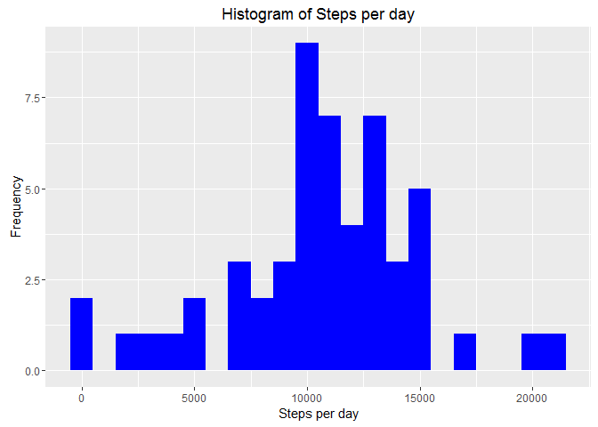
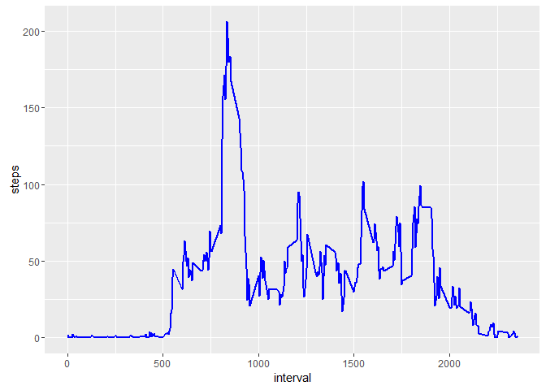
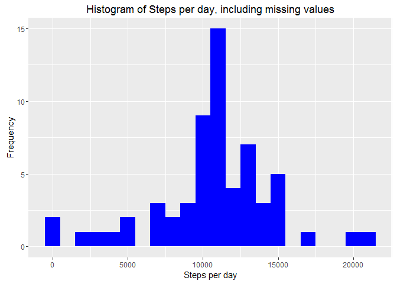
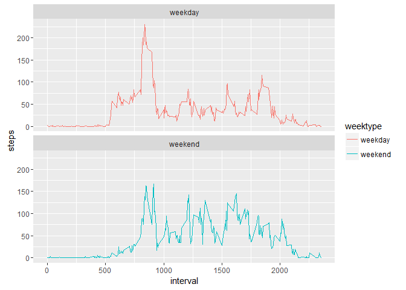

# Reproducible Research: Peer Assessment 1
Firdaus Afifi  
24th February 2017  

## Introduction

It is now possible to collect a large amount of data about personal movement using activity monitoring devices such as a Fitbit, Nike Fuelband, or Jawbone Up. These type of devices are part of the “quantified self” movement – a group of enthusiasts who take measurements about themselves regularly to improve their health, to find patterns in their behavior, or because they are tech geeks. But these data remain under-utilized both because the raw data are hard to obtain and there is a lack of statistical methods and software for processing and interpreting the data.

This assignment makes use of data from a personal activity monitoring device. This device collects data at 5 minute intervals through out the day. The data consists of two months of data from an anonymous individual collected during the months of October and November, 2012 and include the number of steps taken in 5 minute intervals each day.

The data for this assignment can be downloaded from the course web site:

Dataset: [Activity monitoring data](https://d396qusza40orc.cloudfront.net/repdata%2Fdata%2Factivity.zip) [52K]

The variables included in this dataset are:

* steps: Number of steps taking in a 5-minute interval (missing values are coded as NA)
* date: The date on which the measurement was taken in YYYY-MM-DD format
* interval: Identifier for the 5-minute interval in which measurement was taken

The dataset is stored in a comma-separated-value (CSV) file and there are a total of 17,568 observations in this dataset.

## R Preparation and library loading

1. Load the important library for Knitr

```r
library(knitr)
opts_chunk$set(echo = TRUE)
```
2. Load the `dplyr`, `lubridate`, `ggplot2` and `broman` library


```r
library(dplyr)
library(lubridate)
library(ggplot2)
library(broman)
```

## Loading and preprocessing the data

Show any code that is needed to:

1. Load the data (i.e. `read.csv()`)
2. Process/transform the data (if necessary) into a format suitable for your analysis

#
There are three steps required, in order to satisfy the process.

1.    Unzip the zip file and make sure `activity.csv` is in the working directory.


```r
activity <- read.csv("activity.csv", header = TRUE, sep = ',', colClasses = c("numeric", "character","integer"))
```
2. Tidying the data


```r
activity$date <- ymd(activity$date)
```
3. Summary the data by using `str()`, `summary()` and `head()`


```r
str(activity)
```

```
## 'data.frame':	17568 obs. of  3 variables:
##  $ steps   : num  NA NA NA NA NA NA NA NA NA NA ...
##  $ date    : Date, format: "2012-10-01" "2012-10-01" ...
##  $ interval: int  0 5 10 15 20 25 30 35 40 45 ...
```

```r
summary(activity)
```

```
##      steps             date               interval     
##  Min.   :  0.00   Min.   :2012-10-01   Min.   :   0.0  
##  1st Qu.:  0.00   1st Qu.:2012-10-16   1st Qu.: 588.8  
##  Median :  0.00   Median :2012-10-31   Median :1177.5  
##  Mean   : 37.38   Mean   :2012-10-31   Mean   :1177.5  
##  3rd Qu.: 12.00   3rd Qu.:2012-11-15   3rd Qu.:1766.2  
##  Max.   :806.00   Max.   :2012-11-30   Max.   :2355.0  
##  NA's   :2304
```

```r
head(activity)
```

```
##   steps       date interval
## 1    NA 2012-10-01        0
## 2    NA 2012-10-01        5
## 3    NA 2012-10-01       10
## 4    NA 2012-10-01       15
## 5    NA 2012-10-01       20
## 6    NA 2012-10-01       25
```

## What is mean total number of steps taken per day?

For this part of the assignment the missing values can be ignored.

1. Calculate the total number of steps taken per day.
2. Make a histogram of the total number of steps taken each day.
3. Calculate and report the mean and median of the total number of steps taken per day.

In order to satisfy the question, there are three main steps.

1. Total number of steps taken per day using `dplyr` and group by `date`


```r
steps <- activity %>%
  filter(!is.na(steps)) %>%
  group_by(date) %>%
  summarize(steps = sum(steps)) %>%
  print
```

```
## Source: local data frame [53 x 2]
## 
##          date steps
##        (date) (dbl)
## 1  2012-10-02   126
## 2  2012-10-03 11352
## 3  2012-10-04 12116
## 4  2012-10-05 13294
## 5  2012-10-06 15420
## 6  2012-10-07 11015
## 7  2012-10-09 12811
## 8  2012-10-10  9900
## 9  2012-10-11 10304
## 10 2012-10-12 17382
## ..        ...   ...
```
  
2. Draw a histrogram using `ggplot`


```r
ggplot(steps, aes(x = steps)) +
  geom_histogram(fill = "blue", binwidth = 1000) +
  labs(title = "Histogram of Steps per day", x = "Steps per day", y = "Frequency")
```

<!-- -->

3. Calculate the mean and median of the total number of steps taken per day


```r
mean_steps <- mean(steps$steps, na.rm = TRUE)
mean_steps 
```

```
## [1] 10766.19
```

```r
median_steps <- median(steps$steps, na.rm = TRUE)
median_steps 
```

```
## [1] 10765
```

Mean steps are 10766.19 and median steps are 10765.

## What is the average daily activity pattern?

1. Make a time series plot (i.e. `type = "l"`) of the 5-minute interval (x-axis) and the average number of steps taken, averaged across all days (y-axis).
2. Which 5-minute interval, on average across all the days in the dataset, contains the maximum number of steps?.

1. Using `dplyr`, calculate the average number of steps taken in each 5-minute interval per dayand group them by `interval`:


```r
interval <- activity %>%
  filter(!is.na(steps)) %>%
  group_by(interval) %>%
  summarize(steps = mean(steps))
  head(interval)
```

```
## Source: local data frame [6 x 2]
## 
##   interval     steps
##      (int)     (dbl)
## 1        0 1.7169811
## 2        5 0.3396226
## 3       10 0.1320755
## 4       15 0.1509434
## 5       20 0.0754717
## 6       25 2.0943396
```

2. Time series of the 5-minute interval and average steps taken are plots using `ggplot`:


```r
ggplot(interval, aes(x=interval, y=steps)) +
  geom_line(color = "blue", size=1)
```

<!-- -->

3. Identify the maximum step by using `which.max()`.

```r
intervalstep <- interval[which.max(interval$steps),]
intervalstep
```

```
## Source: local data frame [1 x 2]
## 
##   interval    steps
##      (int)    (dbl)
## 1      835 206.1698
```

The interval 835 has, on average, the highest count of steps, with approximately  206 steps.

## Imputing missing values

Note that there are a number of days/intervals where there are missing values (coded as NA). The presence of missing days may introduce bias into some calculations or summaries of the data.

1. Calculate and report the total number of missing values in the dataset (i.e. the total number of rows with NAs)
2. Devise a strategy for filling in all of the missing values in the dataset. The strategy does not need to be sophisticated. For example, you could use the mean/median for that day, or the mean for that 5-minute interval, etc.
3. Create a new dataset that is equal to the original dataset but with the missing data filled in.
4. Make a histogram of the total number of steps taken each day and Calculate and report the mean and median total number of steps taken per day. Do these values differ from the estimates from the first part of the assignment? What is the impact of imputing missing data on the estimates of the total daily number of steps?

The process to fill the missing values are as follow:

1. Summarize all the missing values:

```r
sum(is.na(activity$steps))
```

```
## [1] 2304
```

2. The strategy to fill in the missing values is by using the average number of steps in the same 5-min interval.


```r
activity_noNA <- activity
nas <- is.na(activity_noNA$steps)
avg_interval <- tapply(activity_noNA$steps, activity_noNA$interval, mean, na.rm=TRUE, simplify=TRUE)
activity_noNA$steps[nas] <- avg_interval[as.character(activity_noNA$interval[nas])]
```

3.  Check again the number of missing value.


```r
sum(is.na(activity_noNA$steps))
```

```
## [1] 0
```

4. Calculate the number of steps taken in each 5-minute interval per day using dplyr and group by interval. Use ggplot for making the histogram:


```r
steps_full <- activity_noNA %>%
  filter(!is.na(steps)) %>%
  group_by(date) %>%
  summarize(steps = sum(steps)) %>%
  print
```

```
## Source: local data frame [61 x 2]
## 
##          date    steps
##        (date)    (dbl)
## 1  2012-10-01 10766.19
## 2  2012-10-02   126.00
## 3  2012-10-03 11352.00
## 4  2012-10-04 12116.00
## 5  2012-10-05 13294.00
## 6  2012-10-06 15420.00
## 7  2012-10-07 11015.00
## 8  2012-10-08 10766.19
## 9  2012-10-09 12811.00
## 10 2012-10-10  9900.00
## ..        ...      ...
```

5. Draw a histogram using `ggplot`.


```r
ggplot(steps_full, aes(x = steps)) +
  geom_histogram(fill = "blue", binwidth = 1000) +
  labs(title = "Histogram of Steps per day, including missing values", x = "Steps per day", y = "Frequency")
```

<!-- -->

6. Calculate the mean and median steps with the filled in values.

```r
mean_steps_full <- mean(steps_full$steps, na.rm = TRUE)
mean_steps_full
```

```
## [1] 10766.19
```

```r
median_steps_full <- median(steps_full$steps, na.rm = TRUE)
median_steps_full
```

```
## [1] 10766.19
```

The impact of imputing missing data with the average number of steps in the same 5-min interval is that both the mean and the median are equal to the same value: 10766.19

## Are there differences in activity patterns between weekdays and weekends?

For this part the `weekdays()` function may be of some help here. Use the dataset with the filled-in missing values for this part.

1. Create a new factor variable in the dataset with two levels – “weekday” and “weekend” indicating whether a given date is a weekday or weekend day.
2. Make a panel plot containing a time series plot (i.e. `type = "l"`) of the 5-minute interval (x-axis) and the average number of steps taken, averaged across all weekday days or weekend days (y-axis).

There are two steps required.

1. Use `dplyr` and `mutate()` to create a new column, weektype, and apply whether the day is weekend or weekday.


```r
activity_noNA <- mutate(activity_noNA, weektype = ifelse(weekdays(activity_noNA$date) == "Saturday" | weekdays(activity_noNA$date) == "Sunday", "weekend", "weekday"))
activity_noNA$weektype <- as.factor(activity_noNA$weektype)
head(activity_noNA)
```

```
##       steps       date interval weektype
## 1 1.7169811 2012-10-01        0  weekday
## 2 0.3396226 2012-10-01        5  weekday
## 3 0.1320755 2012-10-01       10  weekday
## 4 0.1509434 2012-10-01       15  weekday
## 5 0.0754717 2012-10-01       20  weekday
## 6 2.0943396 2012-10-01       25  weekday
```

2. Calculate the average steps in the 5-minute interval and draw a time series plot using `ggplot`.


```r
interval_full <- activity_noNA %>%
  group_by(interval, weektype) %>%
  summarise(steps = mean(steps))
s <- ggplot(interval_full, aes(x=interval, y=steps, color = weektype)) +
  geom_line() +
  facet_wrap(~weektype, ncol = 1, nrow=2)
print(s)
```

<!-- -->

